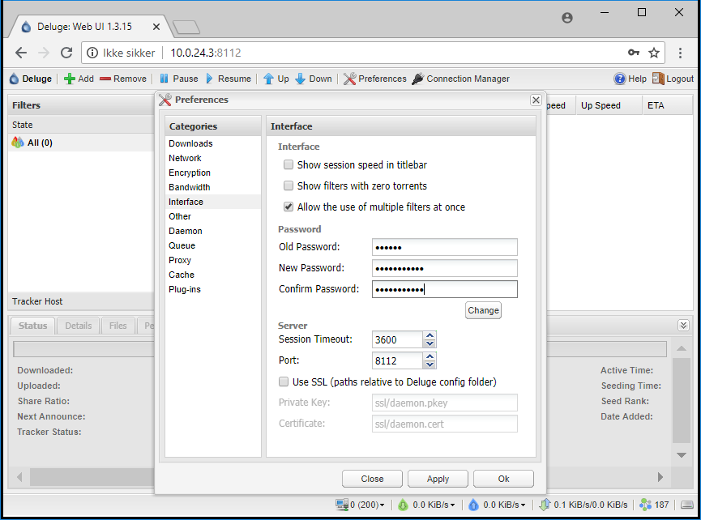

<h1>Installation of Deluge on Ubuntu Server</h1>

This is an easy step-by-step tutorial on how to install and set up Deluge BitTorrent client on a server running Ubuntu Server.
These steps will lead you to a complete installation of Deluge with the necessary configuration that automatically starts during boot.

<h3>Install</h3>

First add the Deluge personal package archive by running ``` sudo add-apt-repository ppa:deluge-team/ppa ```.

Then run ```sudo apt-get update``` to get the update from the above PPA.

Now you can install Deluge, Deluge Web-interface and Deluged by running these three commands:

```sudo apt-get install deluge```

```sudo apt install deluge-web -y```

```sudo apt install deluged```


Now you can verify installation by running ```which deluge deluge-web deluged```, the output should look like this:

```Shell Session
flemmingss@Deluge:~$ which deluge deluge-web deluged
/usr/bin/deluge
/usr/bin/deluge-web
/usr/bin/deluged
```

<h3>Create Service: deluged.servic</h3>

Run ```sudo nano /etc/systemd/system/deluged.service``` to create the Deluged Service file and open Nano text editor.
Paste the folowing inside the file:
```
[Unit]
Description=Deluge Bittorrent Client Daemon
Documentation=man:deluged
After=network-online.target
[Service]
Type=simple
User=flemmingss
Group=flemmingss
UMask=000
ExecStart=/usr/bin/deluged -d
Restart=on-failure
# Time to wait before forcefully stopped.
TimeoutStopSec=300
[Install]
WantedBy=multi-user.target
```
Replace flemmingss in ```User=flemmingss``` with your username, and flemmingss in ```Group=flemmingss``` with your users group (normaly the same as the username).
Use the arrow-keys to maneuver in the file. Use CTRL+O to save the file and CTRL+X to exit the editor. 

Now run the following three commands:

```sudo systemctl enable /etc/systemd/system/deluged.service```

```sudo systemctl start deluged ```

```sudo systemctl status deluged ```

The output should look similar to this:
```Shell Session
flemmingss@Deluge:~$ sudo systemctl enable /etc/systemd/system/deluged.service
Created symlink from /etc/systemd/system/multi-user.target.wants/deluged.service to /etc/systemd/system/deluged.service.
flemmingss@Deluge:~$ sudo systemctl start deluged
flemmingss@Deluge:~$ sudo systemctl status deluged
● deluged.service - Deluge Bittorrent Client Daemon
   Loaded: loaded (/etc/systemd/system/deluged.service; enabled; vendor preset: enabled)
   Active: active (running) since Tue 2018-08-07 21:14:17 CEST; 8s ago
     Docs: man:deluged
 Main PID: 7635 (deluged)
    Tasks: 4
   Memory: 53.8M
      CPU: 554ms
   CGroup: /system.slice/deluged.service
           └─7635 /usr/bin/python /usr/bin/deluged -d

Aug 07 21:14:17 Deluge systemd[1]: Started Deluge Bittorrent Client Daemon.
flemmingss@Deluge:~$
```

<h3>Create Service: deluge-web.service</h3>

Next step is to make a Service file for Deluge-Web, run ```sudo nano /etc/systemd/system/deluge-web.service```.

Paste the folowing inside the file:
```
[Unit]
Description=Deluge Bittorrent Client Web Interface
Documentation=man:deluge-web
After=network-online.target deluged.service
Wants=deluged.service
[Service]
Type=simple
User=flemmingss
Group=flemmingss
UMask=000
# This 5 second delay is necessary on some systems
# to ensure deluged has been fully started
ExecStartPre=/bin/sleep 5
ExecStart=/usr/bin/deluge-web
Restart=on-failure
[Install]
WantedBy=multi-user.target
```
Replace flemmingss in ```User=flemmingss``` with your username, and flemmingss in ```Group=flemmingss``` with your users group.
Save the file and run the following three commands:

```sudo systemctl enable /etc/systemd/system/deluge-web.service```

```sudo systemctl start deluge-web```

```udo systemctl status deluge-web```

The output should look similar to this:
```Shell Session
flemmingss@Deluge:~$ sudo systemctl enable /etc/systemd/system/deluge-web.service
Created symlink from /etc/systemd/system/multi-user.target.wants/deluge-web.service to /etc/systemd/system/deluge-web.service.
flemmingss@Deluge:~$ sudo systemctl start deluge-web
flemmingss@Deluge:~$ sudo systemctl status deluge-web
● deluge-web.service - Deluge Bittorrent Client Web Interface
   Loaded: loaded (/etc/systemd/system/deluge-web.service; enabled; vendor preset: enabled)
   Active: active (running) since Tue 2018-08-07 21:21:02 CEST; 10s ago
     Docs: man:deluge-web
  Process: 7674 ExecStartPre=/bin/sleep 5 (code=exited, status=0/SUCCESS)
 Main PID: 7678 (deluge-web)
    Tasks: 1
   Memory: 48.0M
      CPU: 469ms
   CGroup: /system.slice/deluge-web.service
           └─7678 deluge-web

Aug 07 21:20:57 Deluge systemd[1]: Starting Deluge Bittorrent Client Web Interface...
Aug 07 21:21:02 Deluge systemd[1]: Started Deluge Bittorrent Client Web Interface.
flemmingss@Deluge:~$
```

<h3>Web-interface</h3>

Now it should be ready to use the Web-Interface, run ```sudo reboot``` to reboot the server and verify that it indeed start automatically


Use a Web-browser on a client in the same network and navigate to ```http://<ip>:8112/```. Replace ```<ip>``` with your server's IP-address. If you don't know the IP address you can find ut by using the command ```ifconfig```.
   
This is how the first view look, log in with the default passord which is ```deluge```.


A message will pop up with "We recommend changing the default passord. Do you like to change it now?", click Yes to this. On the next box click on the host and "Connect". In the Preferences window fill in old password (```deluge```) and a new one. Click "Change", "Apply".



Just one thing missing now, click "Downloads" to select a download location. Make sure that the user who run Deluge have necessary access to the location selected.


Sources:
* https://www.youtube.com/watch?v=5OFnqLuYZy
* https://dev.deluge-torrent.org/wiki/UserGuide/Service/systemd
* https://tektab.com/2015/11/13/setting-up-deluge-with-webui-deluge-web-on-a-raspberry-pi/3/
